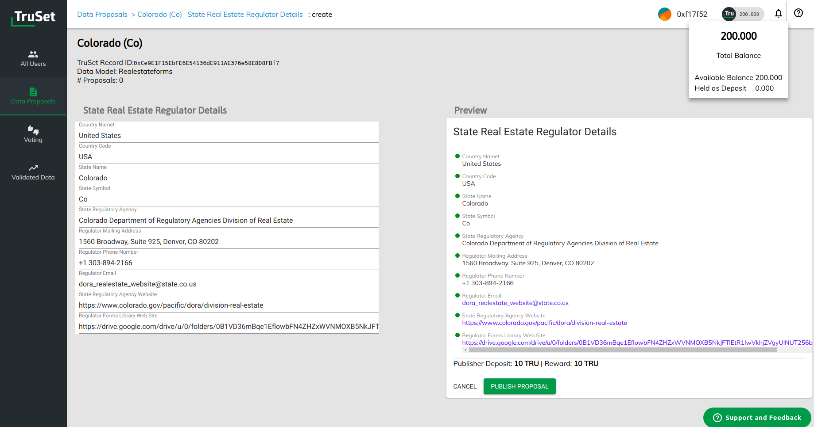

<h3><a href='http://truset.com'>TruSet.com</a> @ <a href='http://consensys.net'>Consensys</a></h3>

TruSet is a platform for publishing and validating data on the Ethereum blockchain by incentivizing community consensus.  Open sourced libraries are <a href='https://truset.github.io'>here</a> including a role based access control and a system for commit reveal voting

<ul>
<li>Solidity</li>
<li>React/Redux</li>
<li>Web3</li>
<li>Go</li>
</ul>
