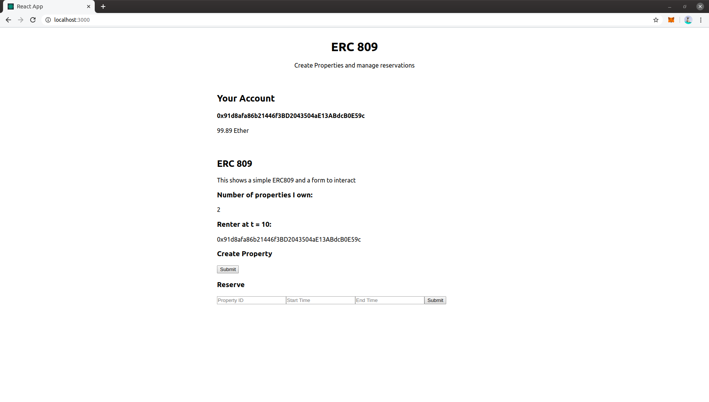

<h3><a href='http://github.com/gtaschuk/saml-eth'>ERC 809</a></h3>

ERC 809 is an ethereum smart contract standard for making an erc721 token loanable for a discrete amount of time.  This implementation uses an interval tree (red black) to ensure rival access to a token.  Payment is locked in the contract.

